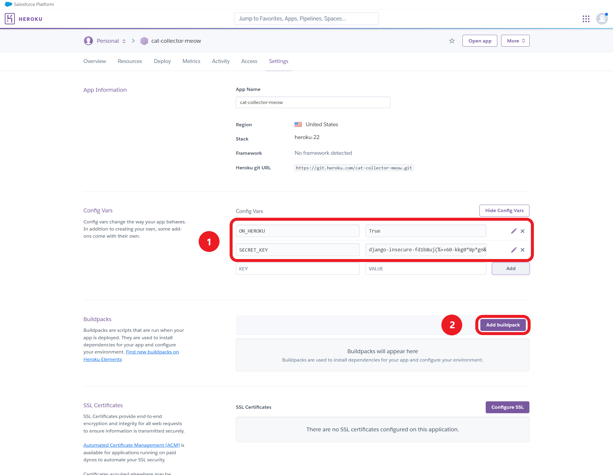
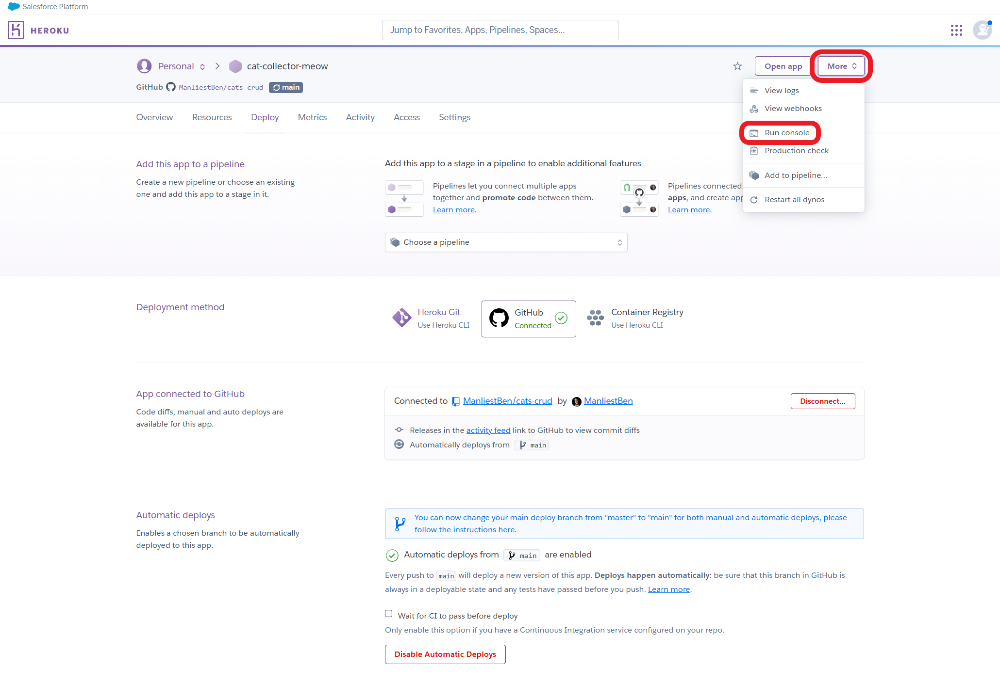
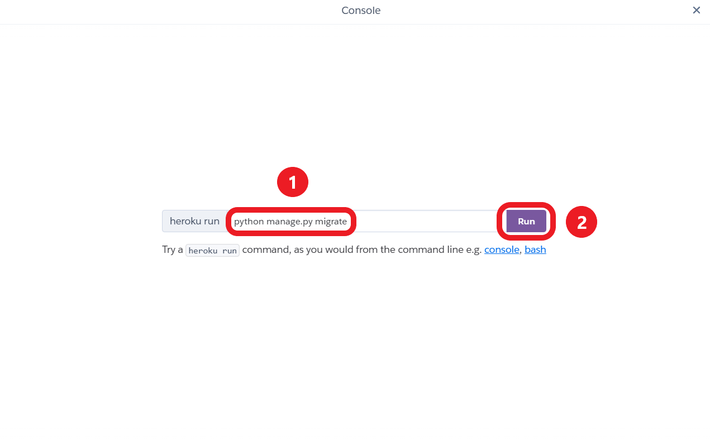
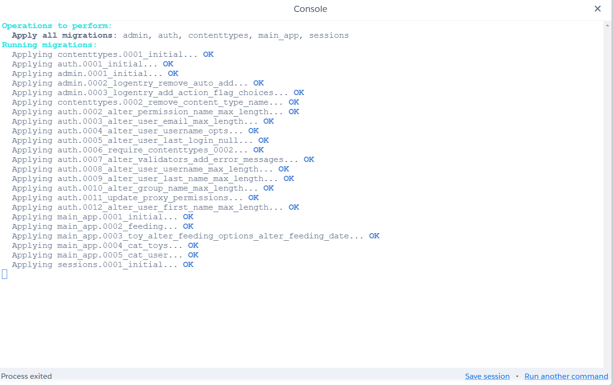
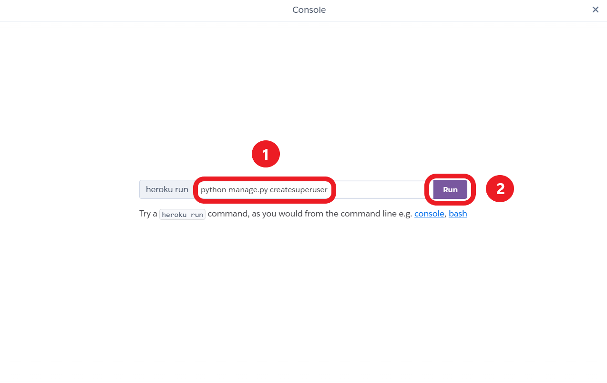
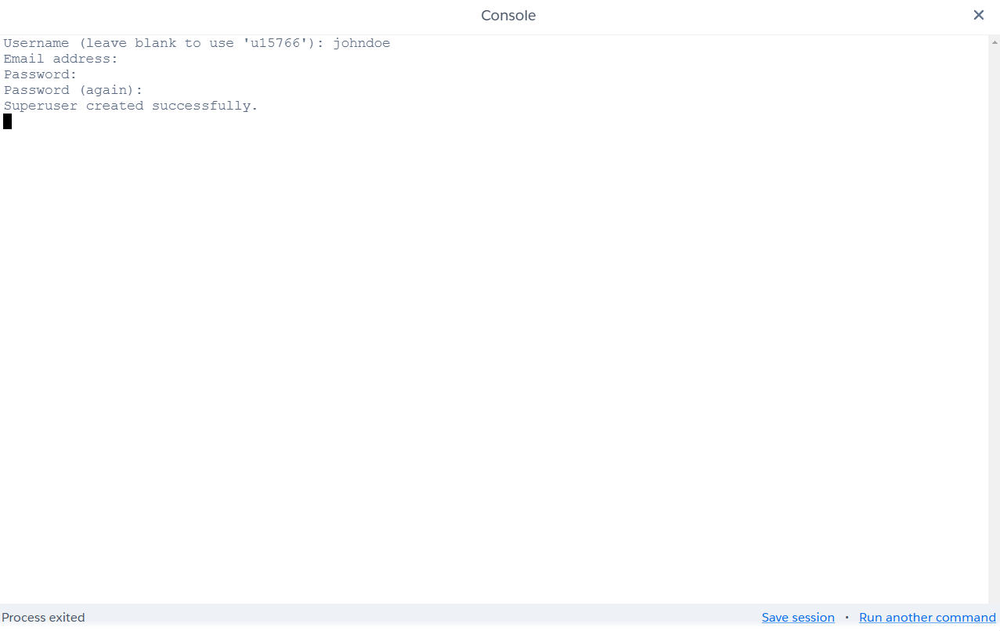
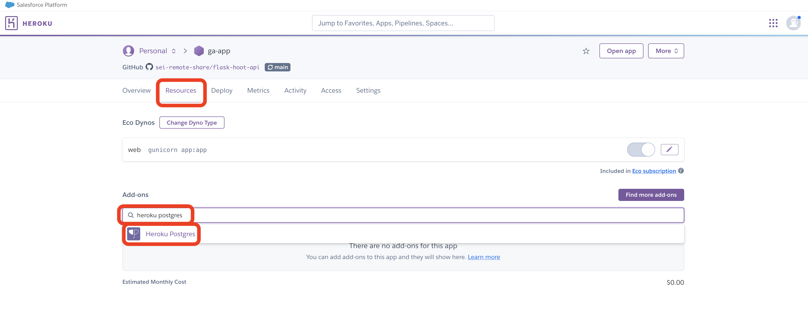
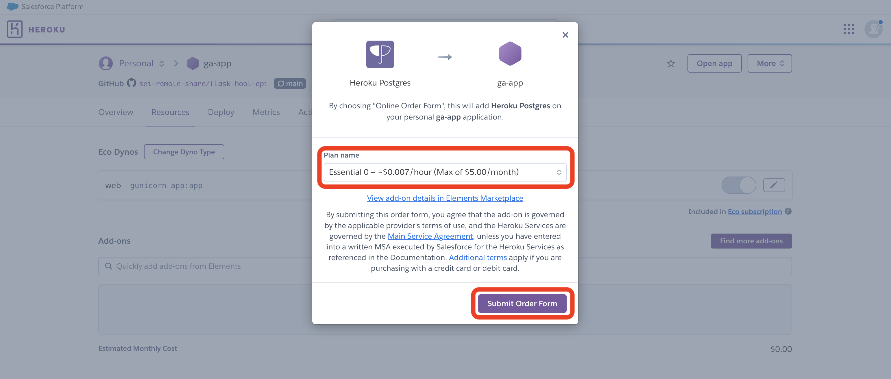

# 

## Intro

This guide will walk you through deploying a Django application to Heroku.

## Getting started (don't skip this, this is important!)

To begin, you'll need:

- A Heroku account. Follow the [Getting Started with Heroku](../getting-started-with-heroku/README.md) guide to walk you through this if you haven't already. You should be signed in to this account.
- A Django app that starts and runs ***without warnings or errors***.
- A `Pipfile` file in the root of your project directory. The contents of this file will vary from project to project, but should at least contain the following three lines somewhere in it:

  ```plaintext
  [packages]
  django = "*"
  psycopg2-binary = "*"
  ```

  There should be additional packages listed here if you've added more Python packages to your project. If you are missing packages from this file, or do not have this file, alert an instructor.

Refer to the **Troubleshooting** section at the end of this document if you have issues while deploying.

## Prepare the Django app to be deployed

There are a few actions we need to take in our Django application before we can deploy. Ensure you are in the root of your project directory in your terminal.

Start by installing all of the necessary packages we'll need throughout this process:

```bash
pipenv install python-dotenv whitenoise gunicorn dj-database-url
```

> 🚨 It is important that you run this exact command to add these packages to your project and ensure they are added to your `Pipfile`. Not running this command in your project

### Configure `python-dotenv`

We'll use environment variables on Heroku to be able to manage our app's behavior when it is deployed. Make use of the [`python-dotenv`](https://pypi.org/project/python-dotenv/) package we just installed, by adding this after your existing imports in `settings.py`:

```python
from dotenv import load_dotenv
import os

load_dotenv()
```

Now that we have `python-dotenv` we can also create a `.env` and add a `SECRET_KEY` to it so that our key is safely hidden before we deploy.

```bash
touch .env
```

Open the `.env` file and add this text:

```plain-text
SECRET_KEY=A_SUPER_SECRET_STRING_NO_ONE_WILL_EVER_GUESS_OR_KNOW
```

Replacing `A_SUPER_SECRET_STRING_NO_ONE_WILL_EVER_GUESS_OR_KNOW` with a super secret string no one will ever guess or know (preferrably generated using a secure method).

Back in `settings.py`, adjust the `SECRET_KEY` variable to use the value from the `.env` configured in the previous step.

```python
# This line of code should be removed
SECRET_KEY = 'django-insecure-fd1b8uj(%++60-kkg0*8p*gn&a19(ydxc_fm5d$r=r&#a2+q^k'
# Your secret key will likely be different

# Replacing it with this
SECRET_KEY = os.getenv('SECRET_KEY')
```

### Configure whitenoise

[Whitenoise](https://pypi.org/project/whitenoise/) helps us serve static assets (images, CSS files, JS files, and so on) in production. Find the `STATIC_URL` configuration setting in `settings.py` and add this beneath it:

```python
STATIC_URL = "static/"

# Add this line of code
STATIC_ROOT = BASE_DIR / "staticfiles"
```

Enable whitenoise in your app by adding it to your middleware in `settings.py` as shown here:

```python
MIDDLEWARE = [
    "django.middleware.security.SecurityMiddleware",
    # Add this. It MUST be added after the line above: 
    "whitenoise.middleware.WhiteNoiseMiddleware",
    # Other items below
]
```

### Set allowed hosts

Find the `ALLOWED_HOSTS` configuration setting in `settings.py`. Change it to this:

```python
ALLOWED_HOSTS = ["*"]
```

On Heroku, it's safe to use a wildcard for `ALLOWED_HOSTS`, since the Heroku router performs validation of the `Host` header in the incoming HTTP request. On other platforms you may need to list the expected hostnames explicitly in production to prevent HTTP Host header attacks. See [here](https://docs.djangoproject.com/en/5.0/ref/settings/#std-setting-ALLOWED_HOSTS) for more.

### Prepare the app to connect to a Heroku Postgres database

Find the `DATABASES` configuration setting in `settings.py`. It should look something like this:

```python
DATABASES = {
    'default': {
        'ENGINE': 'django.db.backends.postgresql',
        'NAME': 'catcollector', 
        # Take note of the name, you'll need it in the code you add in a moment
    }
}
```

Replace it with this:

```python
if 'ON_HEROKU' in os.environ:
    DATABASES = {
        "default": dj_database_url.config(
            env='DATABASE_URL',
            conn_max_age=600,
            conn_health_checks=True,
            ssl_require=True,
        ),
    }
else:
    DATABASES = {
        'default': {
            'ENGINE': 'django.db.backends.postgresql',
            'NAME': '<dbnamehere>',
            # The value of 'NAME' should match the value of 'NAME' you replaced.
        }
    }
```

> 🚨 Replace `<dbnamehere>` above (including the `<` and `>` )with the *current name of your default database* (this exists in the `DATABASES` dictionary that you are replacing)

This is a pretty large change - the overall story of this is that our application deployed to Heroku will use a different database than we our local app.

Here's some more detail though:

- Different `DATABASES` dictionaries will be used depending on if we've set the `ON_HEROKU` environment variable - we won't do this locally, but we will set it when we deploy to Heroku.
- In production on Heroku, the database configuration is derived from the `DATABASE_URL` environment variable.
- The [`dj-database-url` package](https://pypi.org/project/dj-database-url/) parses this URL and gets the necessary information from it to actually connect to the database
- `DATABASE_URL` will be set automatically by Heroku when the Heroku Postgres add-on is attached to your Heroku app.
- When running locally, a local Postgres database (the same one you used while building the app so far) will be used instead.

> 🚨 Using a Postgres database addon on Heroku incurs a monthly fee. If you've configured your Heroku account correctly by using EcoDynos for all of your projects you should be able to add a single Heroku Postgres add-on and still be under the maximum credits provided by the GitHub Campus program.
>
> It is important to ensure that all of your applications are deployed using EcoDynos and that you do not have more than a single Heroku Postgres add-on in your account, or you will be billed by Heroku.

### Turn off debug messages in production

Find the `DEBUG` setting in `settings.py`. Add a line to disable debug messages if our app is running on Heroku:

```python
if not 'ON_HEROKU' in os.environ:
    DEBUG = True
```

This keeps our users from seeing development debugging messages and helps keep our app secure.

### Build a Procfile

We need a `Procfile` that tells Heroku how to run our app. This file should be created in the root of the project. In your project directory run this command:

```bash
touch Procfile
```

Open the file. Add this text inside of it:

```plaintext
web: gunicorn <your-project-name-here>.wsgi
```

> 🚨 The project's name should be used in place of `<your-project-name-here>` (including the `<` and `>`). The project name should be the same as your project's folder name, however, you can also verify this project's name by examining this line in `settings.py`:
>
> ```python
> WSGI_APPLICATION = 'catcollector.wsgi.application'
> # catcollector is the project name
> ```

Gunicorn is now responsible for running our app when we're deployed to heroku. This is a production WSGI server that Django will run in outside of our development environments.

### Push your code to GitHub

With all of these changes made, add, commit, and push your code up to GitHub.

## Deploying a Django application with Heroku

Log in to your Heroku account and navigate to the billing section of the site. Make sure you can see the platform credits available to you via GitHub Campus.

Make sure you're subscribed to Eco Dynos to save money. If not yet subscribed, you can just click on the option shown in the image below.


Navigate back to your apps dashboard and select one of the two options shown below to create a new application.


Assign a name to your application. Keep in mind this name will be in the URL Heroku assigns your application.


After creating your application you'll be taken to the application page. From here, navigate to your application settings.


On your application settings page, define your environment variables.


At a minimum, you will need:

```plaintext
ON_HEROKU=true
SECRET_KEY=A_SUPER_SECRET_STRING_NO_ONE_WILL_EVER_GUESS_OR_KNOW
```

> 🚨 ***Do not add the `ON_HEROKU` environment variable to your local `.env` file. You should not have an `ON_HEROKU` environment variable in your `.env` file at all. Do not add `ON_HEROKU=False` to your local `.env` file.***

Your specific application may require more environment variables than this. You ***do not*** need to include any environment variables that begin with `POSTGRES_` in your config vars on Heroku.



You'll also need to tell Heroku what type of application your website will be. We can do that using buildpacks. Underneath your config vars, select the option to add a buildpack.

Select the Python buildpack.


### Connecting your app to GitHub

Now that your Heroku application is properly configured, it's time to connect your GitHub account and deploy your app from GitHub.

Select the Deploy option in your application page toolbar, select GitHub as your deployment method, and then connect your GitHub account.


Once you've connected your GitHub account, specify which repository you'll use to deploy your application.


Upon selecting your repository, you can select a specific branch to deploy your app from. Enable automatic deploys so that your Heroku app updates every time the branch you selected is pushed to.


Additionally, you can trigger a manual deploy to instantly deploy your application.

## Updating your deployed site

Your app will update automatically whenever you push the the `main` branch on GitHub.

## Migrating on your Heroku Postgres database (repeat when you want to add tables)

We need our database to have tables before we can add any data to it, or we might want to alter, add, or delete tables later on. The steps to follow are the same, no matter which action we're taking.

Click on the 'More' button at the top of the page and select 'Run Console' from the dropdown.



To apply the migrations in your application to the newly-created database, you'll need to run the same command we've used in Django using this console.  Type `python manage.py migrate` in the input field and click the 'Run' button.



The output should look very similar to the output from running this command using the local Postgres database during development.



## Creating a super user

You can use the same process to create a super user, granting access to the admin portal within the deployed application.  Enter `python manage.py createsuperuser`, the same way you did when creating a super user in the local Postgres database.



Enter a username, optionally enter an email address, then enter (and verify) a password that meets the criteria specified in your application's auth validators.

The username must be 150 characters or fewer and consist of letters, digits, and @/./+/-/_ only.

If you haven't adjusted any of the auth validators in your app, your password must meet the following criteria:

- Can't be too similar to your other personal information.
- Must contain at least 8 characters.
- Can't be a commonly used password.
- Can't be entirely numeric.

> 🚨 Remember that you won't be able to see the password as you're typing it!

The output should look like this:



## Troubleshooting

You'll find some troubleshooting steps for common issues below. If a solution to your problem isn't documented below, reach out to your instructor for assistance.

### Postgres database on Heroku was not created automatically

Sometimes a Postgres database will not be provisioned automatically for your application. This is common if your first application build failed for some reason. You'll need to manually install the Heroku Postgres add-on to your application by following the below steps.

Navigate to the **Resources** tab for your app, then select the **add-ons search box** and search for **`Heroku Postgres`**.



A dialog box will appear asking you to confirm adding on the database to the project.



> 🚨 As this dialog box points out, using a local Postgres database on Heroku incurs a monthly fee. If you've configured your Heroku account correctly by using EcoDynos for all of your projects you should be able to add a single Heroku Postgres add-on and still be under the maximum credits provided by the GitHub Campus program.
>
> It is important to ensure that all of your applications are deployed using EcoDynos and that you do not have more than a single Heroku Postgres add-on in your account, or you will be billed by Heroku.

Ensure your plan indicates that you will be charged a maximum of $5.00/month then select the **Submit Order Form** button.

Heroku Postgres will enter a provisioning state which may take a few moments to complete.

### Other issues

If you encounter other issues, reach out to an instructor for assistance.
