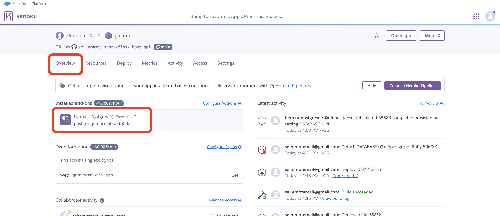
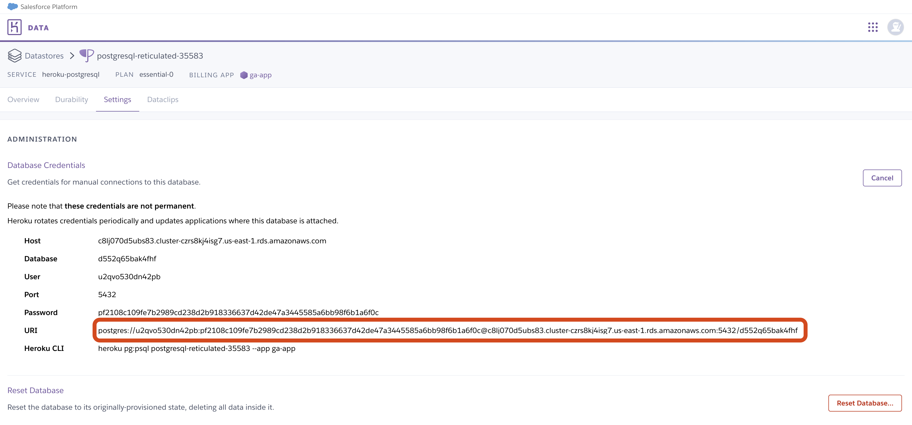

# 

## Intro

This guide will walk you through deploying a Flask application to Heroku.

## Getting started (don't skip this, this is important!)

To begin, you'll need:

- A Heroku account. Follow the [Getting Started with Heroku](../getting-started-with-heroku/README.md) guide to walk you through this if you haven't already. You should be signed in to this account.
- A Flask app that starts and runs ***without warnings or errors***.

## Prepare the Flask app to be deployed

There's a few actions we need to take in our Flask application before we can deploy

### Update database connection

In your `db_helpers.py` file change the `get_db_connection()` to this:

```python
def get_db_connection():
    if 'ON_HEROKU' in os.environ:
        connection = psycopg2.connect(
            os.getenv('DATABASE_URL'), 
            sslmode='require'
        )
    else:
        connection = psycopg2.connect(
            host='localhost',
            database=os.getenv('POSTGRES_DATABASE'),
            user=os.getenv('POSTGRES_USERNAME'),
            password=os.getenv('POSTGRES_PASSWORD')
        )
    return connection
```

This checks for the `ON_HEROKU` environment variable we created on Heroku earlier. If it is present we'll use a local database on Heroku, otherwise, we'll use the local database on our device.

> 🚨 Using a local Postgres database on Heroku incurs a monthly fee. If you've configured your Heroku account correctly by using EcoDynos for all of your projects you should be able to add a single Heroku Postgres add-on and still be under the maximum credits provided by the GitHub Campus program.
>
> It is important to ensure that all of your applications are deployed using EcoDynos and that you do not have more than a single Heroku Postgres add-on in your account, or you will be billed by Heroku.

### Build a Procfile

We need a `Procfile` that tells Heroku how to run our app. This file should be created in the root of the project. In your project directory run this command:

```bash
touch Procfile
```

Open the file. Add this text inside of it:

```plaintext
web: gunicorn app:app
```

Gunicorn is now responsible for running our app when we're deployed to heroku. This is a production WSGI server that Flask wants to run in outside of our development environments.

### Allow gunicorn to start the server

Right now, we're controlling how the app runs in the `app.py` file with the `app.run()` line. However, gunicorn needs to take on this responsiblity in our deployed app.

This means we need to conditaionlly run the `app.run()` line in the `app.py` file. Change this line (towards the end of the file):

```python
app.run()
```

To this:

```python
if __name__ == '__main__':
    app.run()
```

### Push your code to GitHub

With all of these changes made, add, commit, and push your code up to GitHub.

## Deploying a Flask application with Heroku

Log in to your Heroku account and navigate to the billing section of the site. Make sure you can see the platform credits available to you via GitHub Campus.

Make sure you're subscribed to Eco Dynos to save money. If not yet subscribed, you can just click on the option shown in the image below.


Navigate back to your apps dashboard and select one of the two options shown below to create a new application.


Assign a name to your application. Keep in mind this name will be in the URL Heroku assigns your application.


After creating your application you'll be taken to the application page. From here, navigate to your application settings.


On your application settings page, define your environment variables.


At a minimum, you will need:

```plaintext
ON_HEROKU=true
JWT_SECRET=<your-personal-secret-string>
```

> 🚨 ***Do not add the `ON_HEROKU` environment variable to your local `.env` file. You should not have an `ON_HEROKU` environment variable in your `.env` file at all. Do not add `ON_HEROKU=false` to your local `.env` file.***

Your specific application may require more environment variables than this. You ***do not*** need to include any environment variables that begin with `POSTGRES_` in your config vars on Heroku.


You'll also need to tell Heroku what type of application your website will be. We can do that using buildpacks. Underneath your config vars, select the option to add a buildpack.

Select the Python buildpack.


### Connecting your app to GitHub

ow that your Heroku application is properly configured, it's time to connect your GitHub account and deploy your app from GitHub.

Select the Deploy option in your application page toolbar, select GitHub as your deployment method, and then connect your GitHub account.


Once you've connected your GitHub account, specify which repository you'll use to deploy your application.


Upon selecting your repository, you can select a specific branch to deploy your app from. Enable automatic deploys so that your Heroku app updates every time the branch you selected is pushed to.


Additionally, you can trigger a manual deploy to instantly deploy your application.

## Updating your deployed site

Your app will update automatically whenever you push the the `main` branch of your application.

## Setting up a database (one time)

Your app should work, but you won't be able to do anything that would require a database so far because our app isn't connected to a database yet.

Navigate to the **Resources** tab for your app, then select the **add-ons search box** and search for **`Heroku Postgres`**.


A dialog box will appear asking you to confirm adding on the database to the project.


> 🚨 As this dialog box points out, using a local Postgres database on Heroku incurs a monthly fee. If you've configured your Heroku account correctly by using EcoDynos for all of your projects you should be able to add a single Heroku Postgres add-on and still be under the maximum credits provided by the GitHub Campus program.
>
> It is important to ensure that all of your applications are deployed using EcoDynos and that you do not have more than a single Heroku Postgres add-on in your account, or you will be billed by Heroku.

Ensure your plan indicates that you will be charged a maximum of $5.00/month, then select the **Submit Order Form** button after you have confirmed your applications are all using the EcoDynos plan, that this is your first Heroku Postgres add-on, and that you have no other add-ons attached to your account.

Heroku Postgres will enter a provisioning state which may take a few moments to complete.

## Adding tables to your Heroku Postgres database (repeat when you want to add tables)

We need our database to have tables before we can add any data to it, or we might want to alter, add, or delete tables later on. The steps to follow are the same, no matter which action we're taking.

After your Heroku Postgres add-on has been provisioned to your account, go to the **Overview** tab for your app as shown below. Select the **Heroku Postgres** add-on.



You'll be taken to the Heroku Postgres app. Select the **Settings** tab, then select the **View credentials...** button to view your database credentials.

Copy the URI as outlined in the screenshot below:



> 🚨 You must copy the ***entire*** URI. Do not leave off any pieces.

With the URI in hand, go to your terminal application and run the `psql` command followed by the URI you just copied:

```bash
psql <heroku-postgres-db-uri>
```

> 🚨 Do not copy the above command. It will not work. Replace `<heroku-postgres-db-uri>` above (including the `<` and `>`) with the database URI you just copied.
>
> Unfortunately, this URI can change, so you will likely need to return to the Heroku app dashboard again later to get a new database URI if a substantial amount of time has passed between your interactions with this database. Keep the steps here handy to help you with this.

Modify the above command, then run it. You will now be connected to the Heroku Postgres database in the `psql` shell. Here, you can take any action you would take on a local database. For example, you might set up a `user` table with the following command:

```sql
CREATE TABLE users (
    id SERIAL PRIMARY KEY,
    username VARCHAR(50) NOT NULL,
    password VARCHAR(255) NOT NULL
);
```

Run the necessary commands in the `psql` shell to add, remove, and modify the database tables for your deployed application. This does not sync with your local postgres database, you'll need to return here anytime you make modifications to ensure the two stay in sync.
