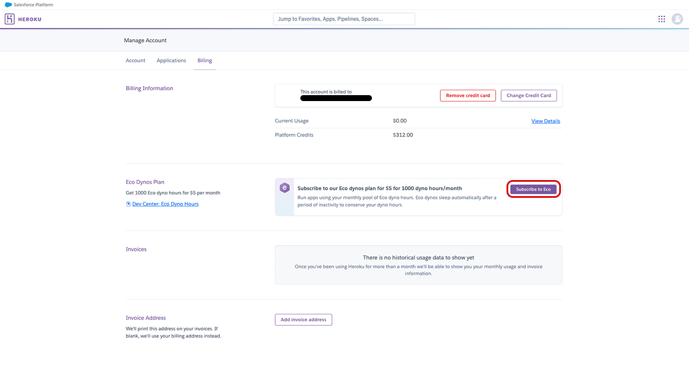
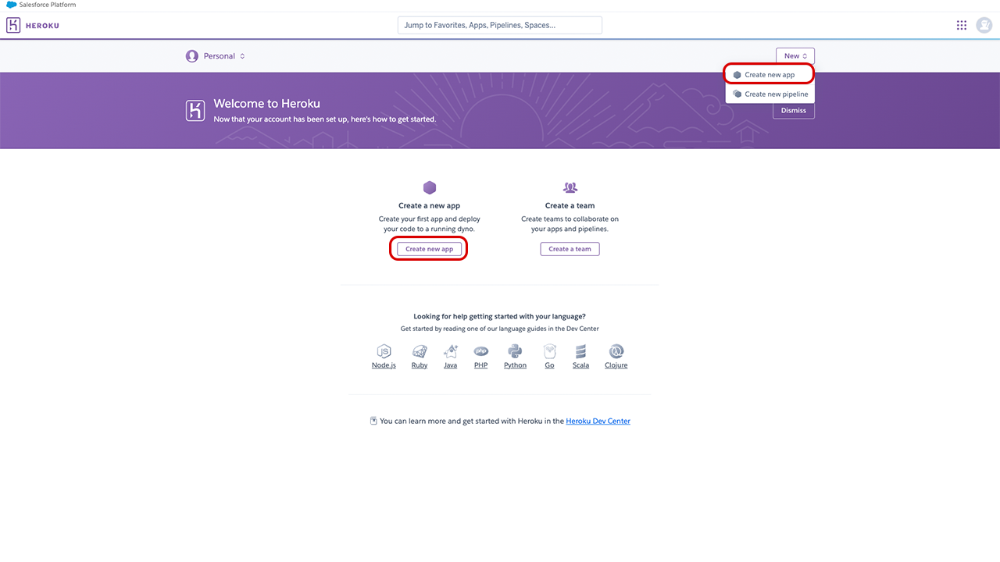
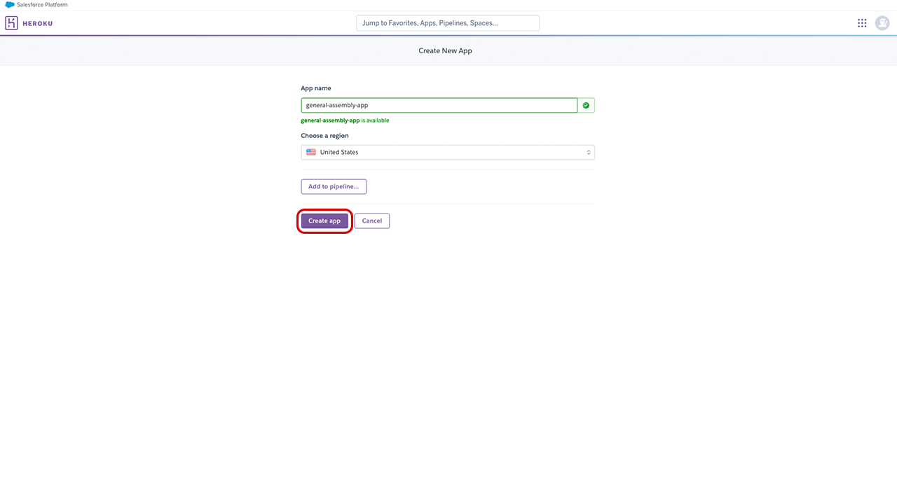
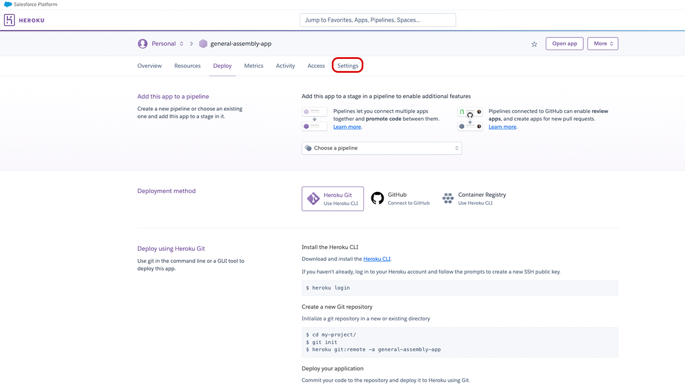
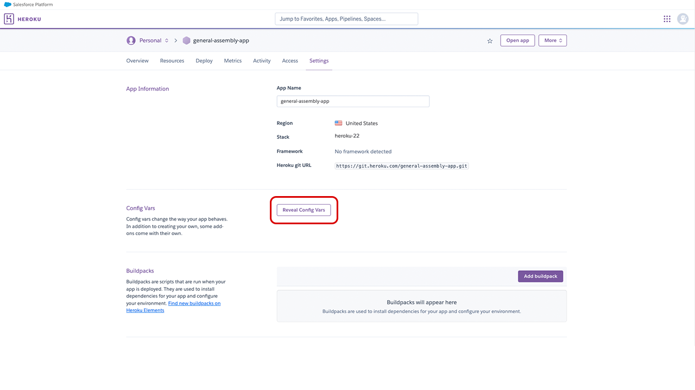
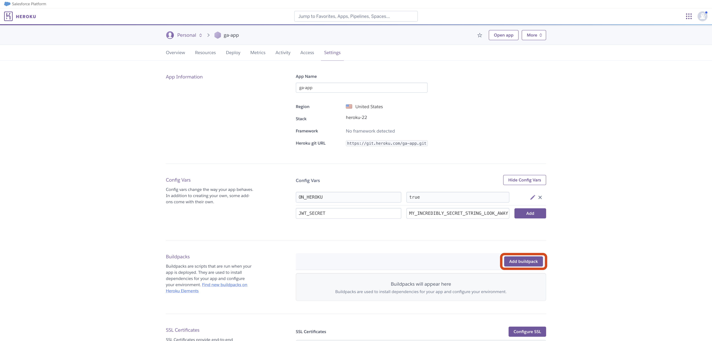
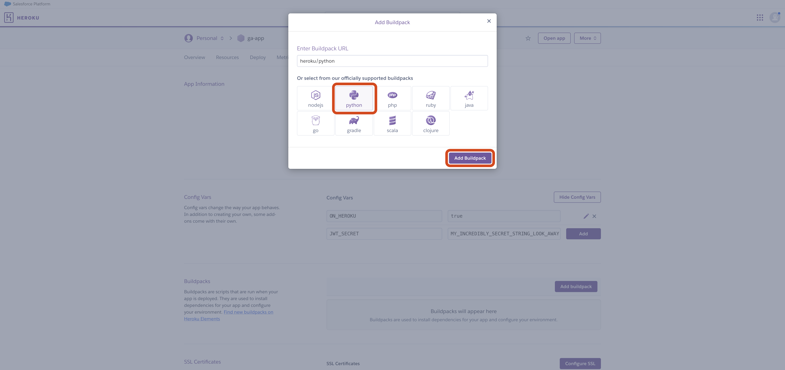
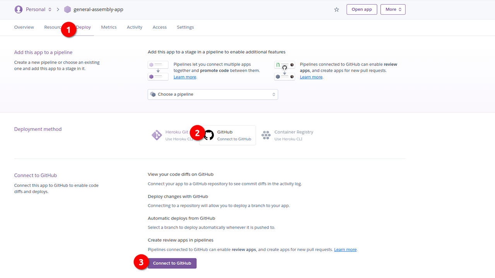
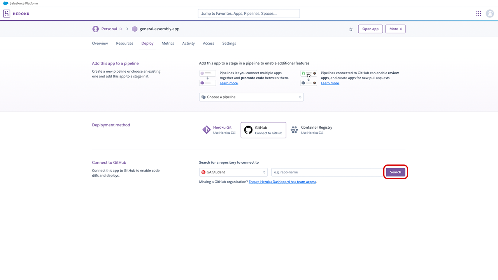
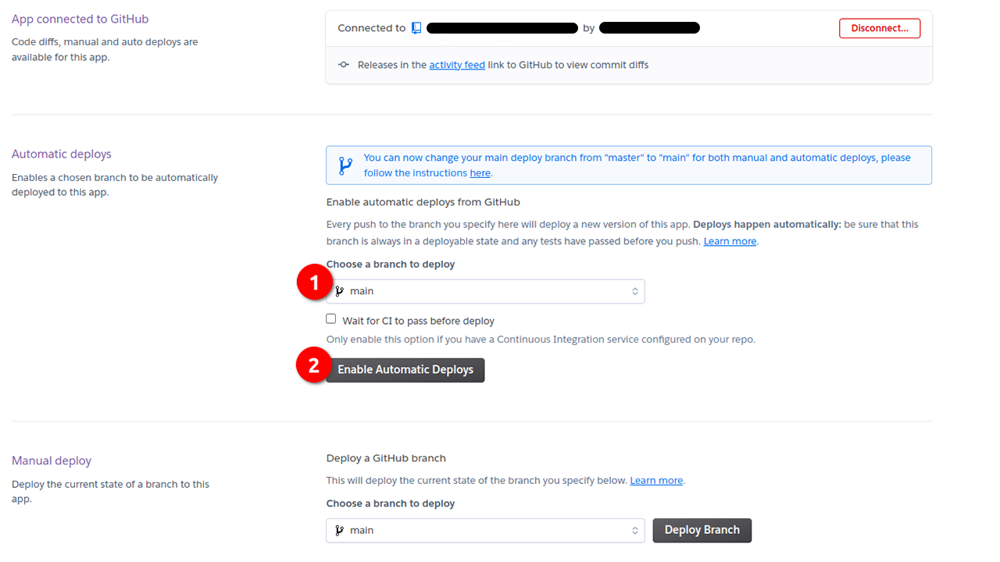

# 

## Intro

This guide will walk you through deploying a Flask application to Heroku.

## Getting started (don't skip this, this is important!)

To begin, you'll need:

- A Heroku account. Follow the [Getting Started with Heroku](../getting-started-with-heroku/README.md) guide to walk you through this if you haven't already. You should be signed in to this account.
- A Flask app that starts and runs ***without warnings or errors***.

## Prepare the Flask app to be deployed

There's a few actions we need to take in our Flask application before we can deploy

### Update database connection

In your `db_helpers.py` file change the `get_db_connection()` to this:

```python
def get_db_connection():
    if 'ON_HEROKU' in os.environ:
        connection = psycopg2.connect(
            os.getenv('DATABASE_URL'), 
            sslmode='require'
        )
    else:
        connection = psycopg2.connect(
            host='localhost',
            database=os.getenv('POSTGRES_DATABASE'),
            user=os.getenv('POSTGRES_USERNAME'),
            password=os.getenv('POSTGRES_PASSWORD')
        )
    return connection
```

This checks for the `ON_HEROKU` environment variable we created on Heroku earlier. If it is present we'll use a local database on Heroku, otherwise, we'll use the local database on our device.

> 🚨 Note that using a local Postgres database on Heroku incurs a monthly fee. If you've configured your Heroku account correctly by using EcoDynos for all of your project you should be able to deploy a single app that uses a Postgres database to Heroku along with any number of other applications (without SQL databases) and not be charged.

### Build a Procfile

We need a `Procfile` that tells Heroku how to run our app. This file should be created in the root of the project. In your project directory run this command:

```bash
touch Procfile
```

Open the file. Add this text inside of it:

```plaintext
web: gunicorn app:app
```

gunicorn is now responsible for running our app when we're deployed to heroku.

### Allow gunicorn to start the server

Right now, we're controlling how the app runs in the `app.py` file with the `app.run()` line. However, gunicorn needs to take on this responsiblity in our deployed app.

This means we need to conditaionlly run the `app.run()` line in the `app.py` file. Change this line (towards the end of the file):

```python
app.run()
```

To this:

```python
if __name__ == '__main__':
    app.run()
```

### Push your code to GitHub

With all of these change made, add, commit, and push your code up to GitHub.

## Deploying a Flask application with Heroku

Log in to your Heroku account and navigate to the billing section of the site. Make sure you can see the platform credits available to you via GitHub Campus.

Make sure you're subscribed to Eco Dynos to save money. If not yet subscribed, you can just click on the option shown in the image below.



Navigate back to your apps dashboard and select one of the two options shown below to create a new application.



Assign a name to your application. Keep in mind this name will be in the URL Heroku assigns your application.



After creating your application you'll be taken to the application page. From here, navigate to your application settings.



On your application settings page, define your environment variables.



At a minimum, you will need:

```plaintext
ON_HEROKU=true
JWT_SECRET=<your-personal-secret-string>
```

Your specific application may require more environment variables than this. You ***do not*** need to include any environment variables that begin with `POSTGRES_` in your config vars on Heroku.

You'll also need to tell Heroku what type of application your website will be. We can do that using buildpacks. Underneath your config vars, select the option to add a buildpack.



Select the Python buildpack.



### Connecting your app to GitHub

ow that your Heroku application is properly configured, it's time to connect your GitHub account and deploy your app from GitHub.

Select the Deploy option in your application page toolbar, select GitHub as your deployment method, and then connect your GitHub account.



Once you've connected your GitHub account, specify which repository you'll use to deploy your application.



Upon selecting your repository, you can select a specific branch to deploy your app from. Enable automatic deploys so that your Heroku app updates every time the branch you selected is pushed to.



Additionally, you can trigger a manual deploy to instantly deploy your application.

## Updating your deployed site

Your app will update automatically whenever you push the the `main` branch on GitHub.
