# 

## Intro

This guide will walk you through deploying a MEN stack application on Heroku.

You should already have set up a Heroku account. If not, refer to [this walkthrough](../getting-started-with-heroku/README.md) to set one up.

## Step 1. Configure your MEN Stack Application

### Create a `start` Script

Up until now, we've run our Express apps by executing `nodemon` which is an npm script that watches the JavaScript files within a project directory for changes. Whenever changes are detected, the app is re-launched, speeding up development time. While this is ideal for development, when our app is in production (or deployed) we don't need or want it to restart at any point.

Take a look at your `package.json` and ensure there's an npm script called start.

```json
"scripts": {
    "test": "echo \"Error: no test specified\" && exit 1",
    "start": "node server.js",
    "dev": "nodemon server.js -e css,ejs,js,json"
  },
```

`npm run start` is the default script and entry point to your app. Heroku will execute `npm run start` when it deploys your application. You can also run this on your machine to test out the production version of your app.


### Step 2: Set up a Heroku MEN Application

Log in to your Heroku account and navigate to the billing section of the site. Make sure you can see the platform credits available to you via GitHub Campus.

Make sure you're subscribed to Eco Dynos to save money. If not yet subscribed, you can just click on the option shown in the image below.

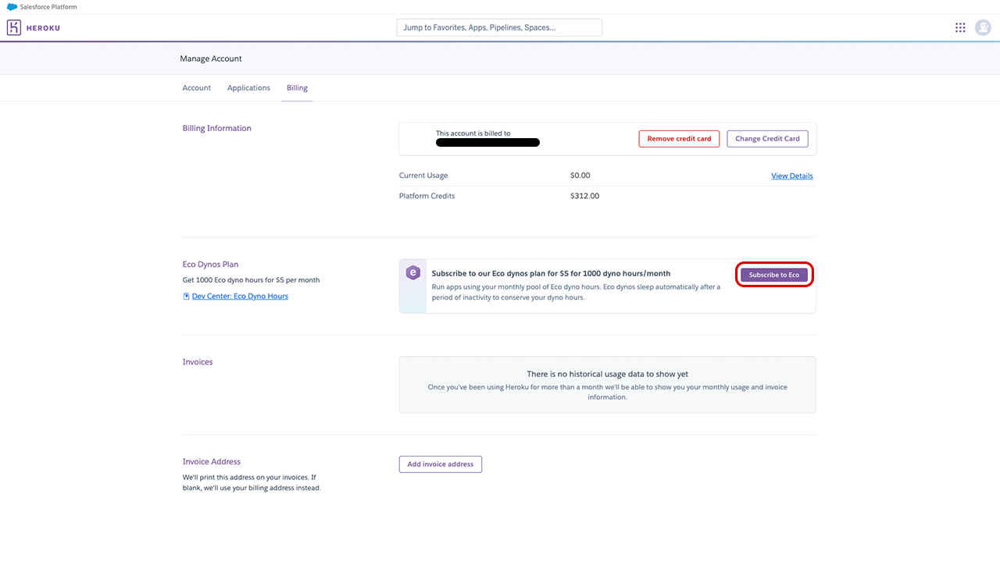

Navigate back to your apps dashboard and select one of the two options shown below to create a new application.

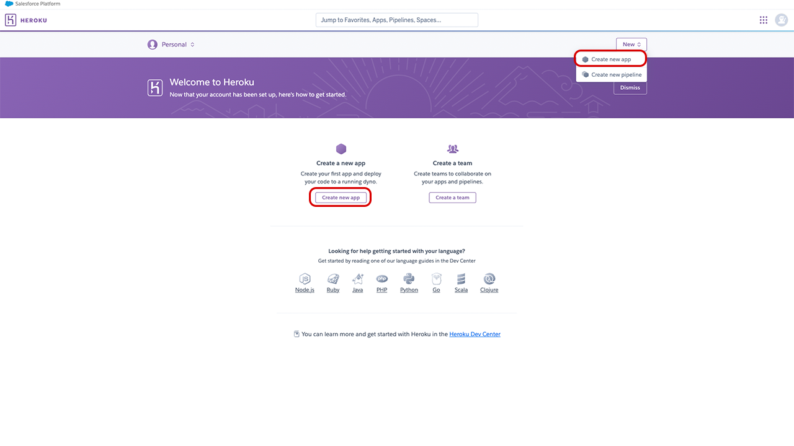

Assign a name to your application. Keep in mind this name will be in the URL Heroku assigns your application.

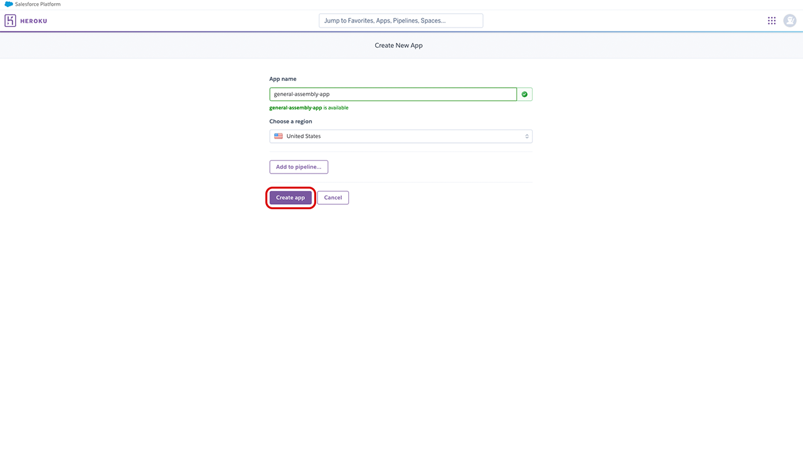

After creating your application you'll be taken to the application page. From here, navigate to your application settings.

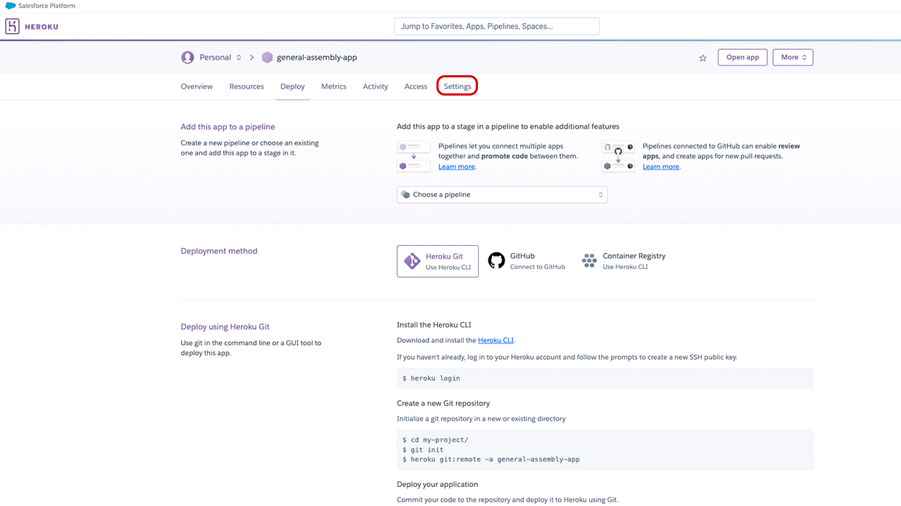

On your application settings page, define your environment variables.

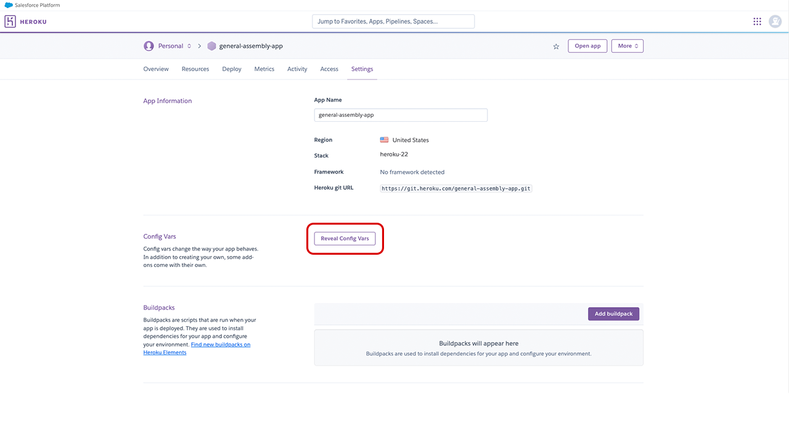

You won't need to define a PORT, but you will need to add your MongoDB Atlas connection string. You will also need to add `ON_HEROKU` to `true`.
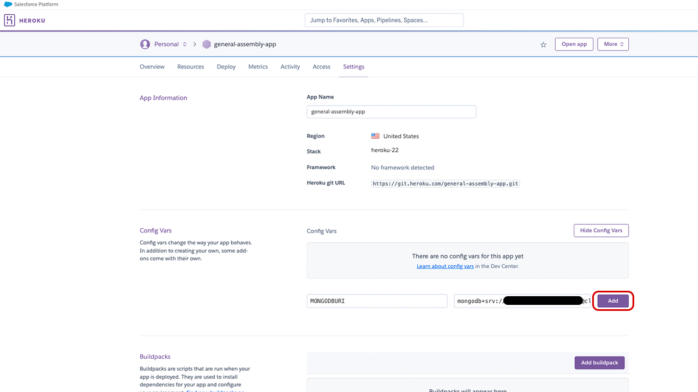

You'll also need to tell Heroku what type of application your website will be. We can do that using buildpacks. Underneath your config vars, select the option to add a buildpack.
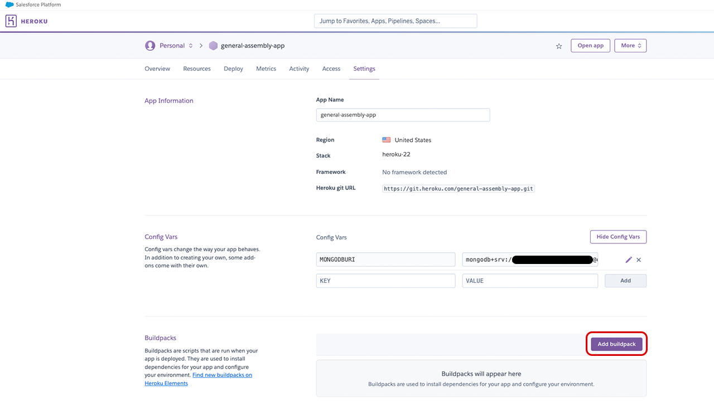

Select the Node.js buildpack.
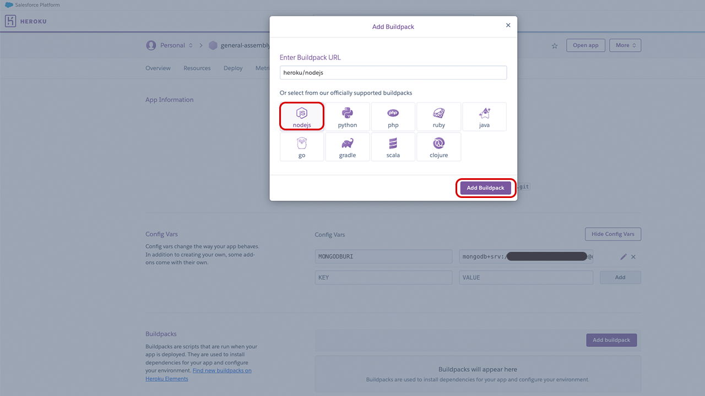

### Step 3: Deploy to Heroku from GitHub

Now that your Heroku application is properly configured, it's time to connect your GitHub account and deploy your app from GitHub.

Select the Deploy option in your application page toolbar, select GitHub as your deployment method, and then connect your GitHub account.

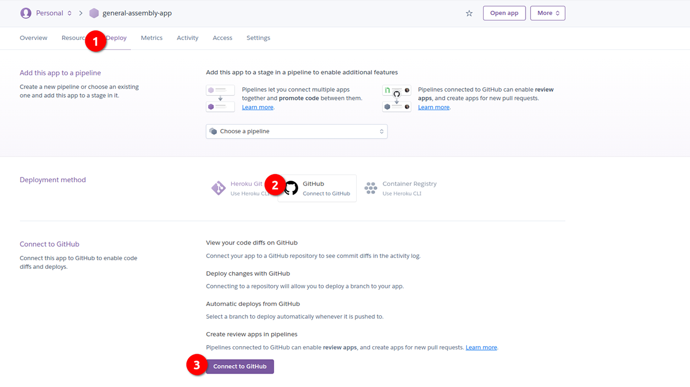

Once you've connected your GitHub account, specify which repository you'll use to deploy your application.

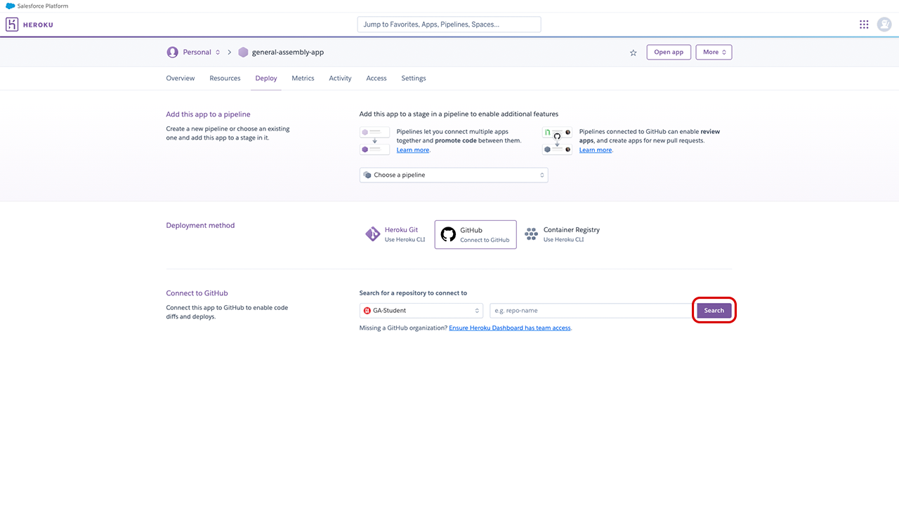

Upon selecting your repository, you can select a specific branch to deploy your app from. Enable automatic deploys so that your Heroku app updates every time the branch you selected is pushed to.

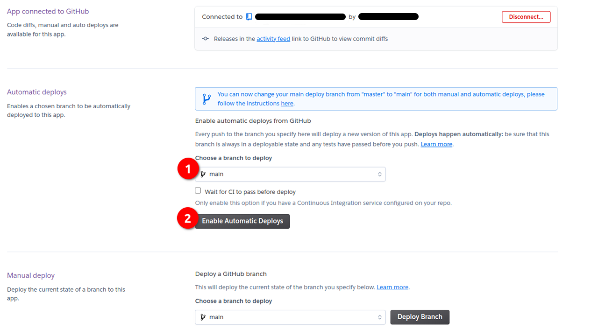

Additionally, you can trigger a manual deploy to instantly deploy your application.
